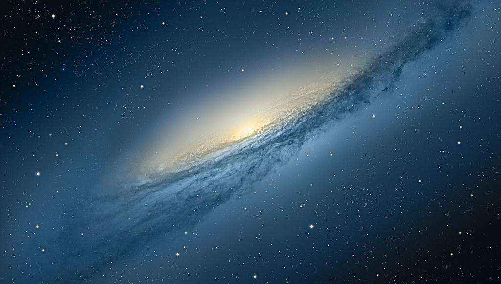

小学时，同学跟我说：”我这辈子得去国外看一看，多看看不同风景！“我一听，这不行啊，我得更厉害点：”这辈子待在地球上也太无聊了，得出地球看看！“

​ 于是高考填志愿时，我选择了航天专业。

在经过系统学习之后，我认为，“一个人的命运，当然要靠自我的奋斗，但也要考虑时代发展的进程。“这个时代不是航天的时代！

现在，我正在学习人工智能的路上，当生产工作都交由机器来做的时候，那应该就是星际航海时代的起点了吧！

于2018年11月06日